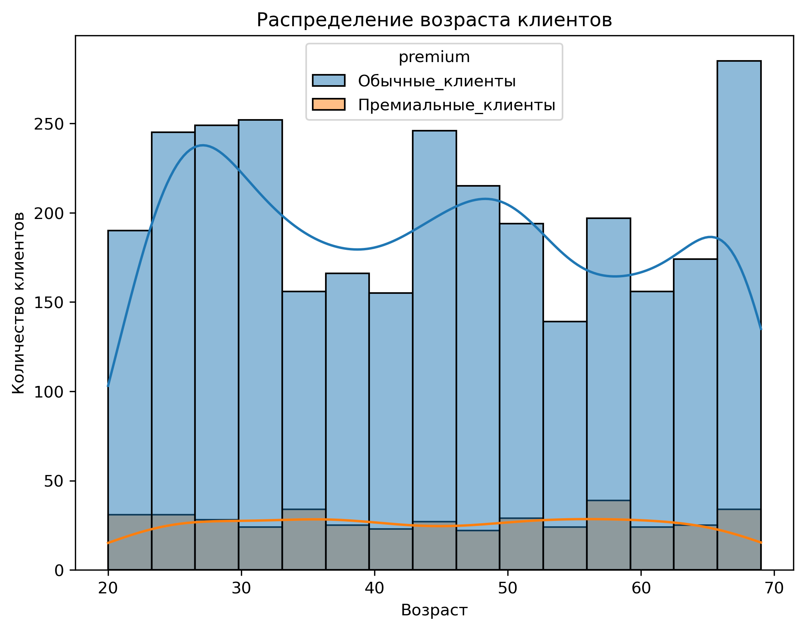

# Анализ поведения клиентов: успешные операции и премиум-сегмент
 
**Инструменты:** `pandas`, `seaborn`, `matplotlib`, `Jupyter Notebook`  

📓 [Ноутбук с анализом](notebooks/analysis.ipynb)  
📊 [Папка с графиками](images/)

## Бизнес-задача
Выявить, какие клиенты и платформы приносят наибольшее число успешных операций, а также определить предпочтения премиум-сегмента для дальнейшего улучшения сервиса.

## Навыки, которые демонстрирует проект
- Объединение таблиц (`merge`)
- Группировки и агрегации (`groupby`, `agg` с lambda)
- Фильтрация и подсчёт уникальных значений
- Визуализация распределений (`histplot`, `countplot`)
- Формулировка бизнес-выводов на основе данных

## Ключевые результаты
- **Топ клиенты:** ID 12179, 28719, 36165, 52870, 61468, 61473, 78349, 82563, 92584 (41 успешная операция)  
- **Лучшая платформа:** `phone` (1565 успешных операций)  
- **Премиум-клиенты предпочитают:** платформу `phone` (242 успешные операции в премиум-сегменте)  
- **Обнаруженная аномалия:** 9 клиентов совершили по 41 операции, тогда как большинство — всего 1-2.
- **Распределение возраста:** премиум-клиенты распределены равномерно (20-68 лет), у обычных клиентов — три пика: 25-30, 45 и 65+ лет.
- **Наибольшая активность на `computer`:** возраст 28 лет (пик около 49 операций).

## Пример визуализации

## Рекомендации для бизнеса
1. **Усилить мобильную платформу** — `phone` лидирует по успешным операциям.
2. **Проверить аномальных клиентов** — 9 пользователей с 41 операцией (возможна накрутка).
3. **Таргетировать возрастные группы** 25-30, 45, 65+ лет для обычных клиентов.
4. **Сфокусироваться на возрасте 28 лет** для рекламы на платформе `computer`.
